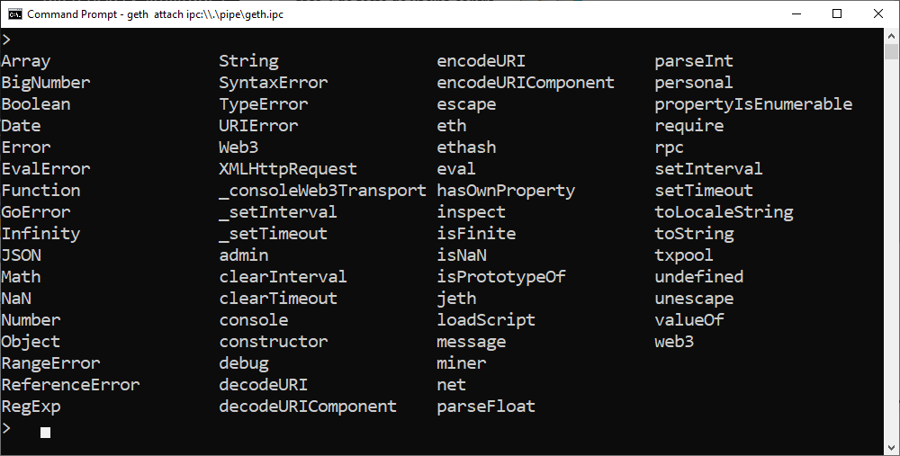
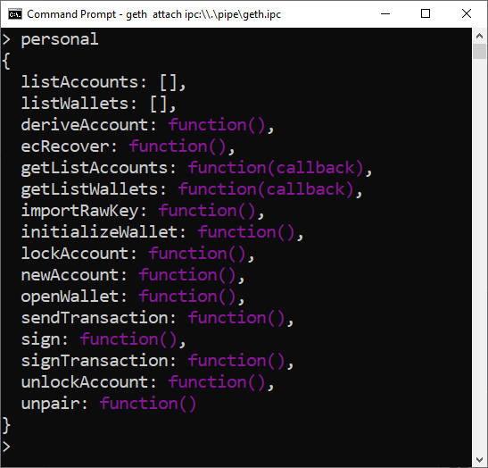
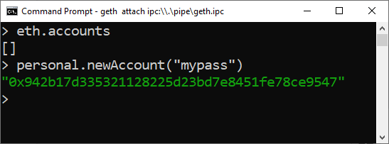
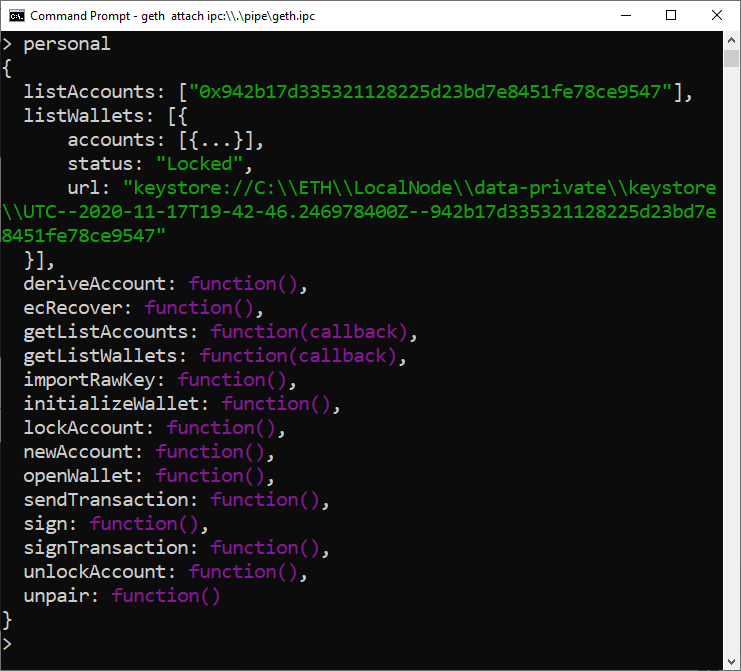
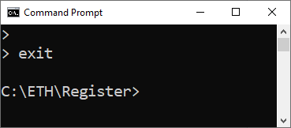

# Geth JavaScript Console

Geth has a JavaScript console which can be used in a Geth node to send some commands to it.

#### Geth console

The `console` subcommand starts the geth node and then opens the console in the same window. 

#### Geth attach

The `attach` subcommand attaches to the console to an already-running geth instance in another window.

Learn more: [Geth javascriptconsole](https://geth.ethereum.org/docs/interface/javascript-console)

## Geth with IPC - Geth attach

I will show how to use Geth attach to connect to an already-running Geth local node and run some commands inside it.

> [!NOTE]
> It can be used for any Geth node, but here I will do it connected to a Geth local node.

## Run a Geth local node

Firt of all, you need to have Geth running in another terminal window.

Go to [Geth local node](/en/geth/geth-local-node.md) for help.

## Geth attach using IPC

Open a second terminal window.

You can connect in any folder, but, if you have some javascripts files to run, it is better to do the attach in project's folder.

For example, I will do it in the location `C:\ETH\Register`.

The IPC Path can be obtained when the node is executed, check it out in [IPC Path](/en/geth/geth-local-node?#ipc-path ':target=_blank')

```
geth attach ipc:\\.\pipe\geth.ipc
```


> [!WARNING]
> This procedure is only for a node running in your machine or in a network that you have access to. 
> Geth attach gives you full control of the remote instance, so do not expect someone else to  give you such access to their machine.
> 
## Special Tips

### Copy and paste on Windows OS terminals

In the Geth console, to paste something that you copied from elsewhere, use:

- Right button
- Arrow Right <kbd>&rarr;</kbd>

Do not press both keys at the same time, but in sequence: first `Right button`, then` Right arrow` <kbd>&rarr;</kbd>.

### List commands

This is a tip for listing the available commands. Press 2 spaces and the <kbd>&#8677;</kbd> TAB key twice.
This is the result:



## Personal and Accounts

Return all information related to accounts in your local node.

```js
personal
```



Learn more about [accounts](https://geth.ethereum.org/docs/interface/managing-your-accounts)

### List Accounts

You can list only the accounts:

```js
personal.listAccounts
```


This other command do the same:

```js
eth.accounts
```


### Create account

Create new account:

```js
personal.newAccount("mypass")
```

> [!WARNING]
> You need to save or remember the password as it is used to encrypt your private key on your computer.
> 
> In the example, the password is `mypass`.



This is the address, or public key, of my new account:
`0x942b17d335321128225d23bd7e8451fe78ce9547`

Run the `personal` command again:

```js
personal
```



You'll find an account in `listAccounts`.

### Create another account

We will create a second account, which will be `account[1]`.

> [!NOTE]
> The account's list is zero based, so the second account is `account[1]`.

```js
personal.newAccount("mypass")
```

The `account[1]` is
`0xcc15531a75a9cca4e6da0ba5d36b70e253963bd5`

Run the list accounts command again:

```js
personal.listAccounts
```


## Mining

Start mining

```js
miner.start(1)
```

Stop mining

```js
miner.stop()
```

Learn more about [mining](https://geth.ethereum.org/docs/interface/mining) 

## Balances

To retrieve the balance of an account, per example, `account[0]`:

```js
eth.getBalance(eth.accounts[0])
```

We got a big number because the result is denominated in wei. We can convert to Ether:

```js
web3.fromWei(eth.getBalance(eth.accounts[0]),"ether")
```


### Balance of a specific account

I would like to check an account's balance using this address, like `0x942b17d335321128225d23bd7e8451fe78ce9547` that I created before:

```js
web3.fromWei(eth.getBalance("0x942b17d335321128225d23bd7e8451fe78ce9547"),"ether")
```


## Unlock an account

Before submitting a transaction from an account, you must unlock it in order to spent the funds stored in this account.

```js
personal.unlockAccount(eth.accounts[0], "mypass", 0)
```

The parameters are: 
1. the account which will be unlocked: eth.accounts[0]
2. the password for this account: `mypass`
3. duration until the unlock expires. The default duration is 300 seconds. An explicit 0 in the duration parameter unlocks the key while the Geth console is open (until Geth exits).


## Transfer Ethers

I'd like to transfer 20 Ethers from `accounts[0]` to `accounts[1]`:

```js
eth.sendTransaction({from:eth.accounts[0], to:eth.accounts[1], value: web3.toWei(20, "ether")})
```

Perfect! I got a transaction hash. This means that my transaction was sent to Blockchain and it will be included in a block in a few seconds.

Now I will check the balance of `accounts[1]`:

```js
web3.fromWei(eth.getBalance(eth.accounts[1]),"ether")
```

And the result is:


:tada: 

`accounts[1]` has 20 Ethers!

## Geth exit

To exit the geth console:

```js
exit
```



## Final considerations

Hope it was easy for you to use Geth, an Ethereum client, to run and interact with an local node.

:sun_with_face:
