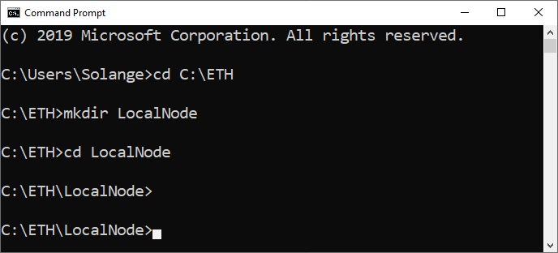

# Geth - create a local node

In this tutorial I will show you step-by-step how to create an Ethereum local node using the Ethereum client Geth.

## Download and install Geth

If you haven't already, go to
[Geth install](/en/geth/geth-install.md)

## Genesis file

1. Create or choose a folder in order to create the genesis file.

I will do it in the folder `C:\ETH\LocalNode`.

On the command prompt: 

```shell
cd C:\ETH
mkdir LocalNode
cd LocalNode
```



2. In the editor of your choice, create a file named `genesis.json`.

Copy and paste this configuration:

```shell
{
	"difficulty"	: "0x10000",
	"gasLimit"  : "0x800000",
	"alloc"     	: {},
	"config"	: {
    "chainId": 1001,
    "homesteadBlock": 0,
    "eip150Block": 0,
    "eip155Block": 0,
    "eip158Block": 0
	}
}
```


## Geth init

Go to the terminal, 
in the folder where you created the `genesis.json` file

Run this command to inicialize a new Blockchain:

<!-- tabs:start -->

#### ** Linux **

If you are in the Geth folder:

```shell
./geth --datadir "/home/eth/data-private"  init "genesis.json"  
```

#### ** Mac OS **

In the Geth folder:

```shell
./geth --datadir "/home/eth/data-private"  init "genesis.json"  
```

#### ** Windows OS **

```shell
geth --datadir "data-private" init "genesis.json"  
```

<!-- tabs:end -->

The Blockchain's database will be located in the folder `data-private`.


## Running Geth

```shell
geth --datadir ".\data-private"
```


## IPC path

The IPC path will be used later to connect to your node, so write it down.


My IPC path is 

```shell
\\.\pipe\geth.ipc
```

## Attaching a JavaScript Console to you node

Go to [Geth JavaScript Console](/en/geth/geth-console-attach.md) to learn how to use the Javascript console to send some commands to your node.

:sun_with_face:
