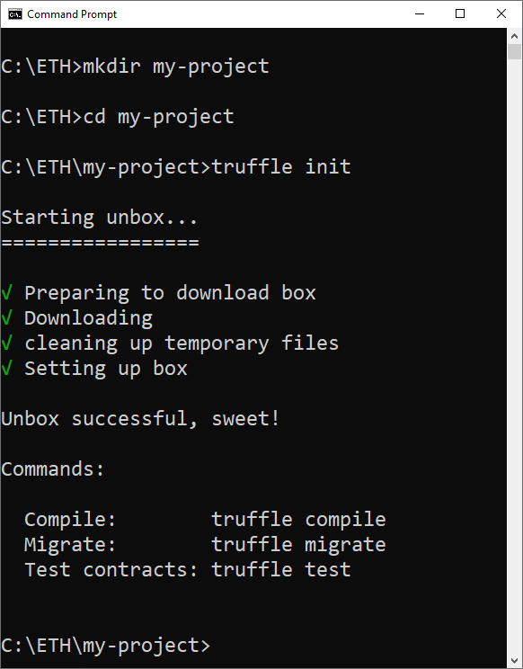
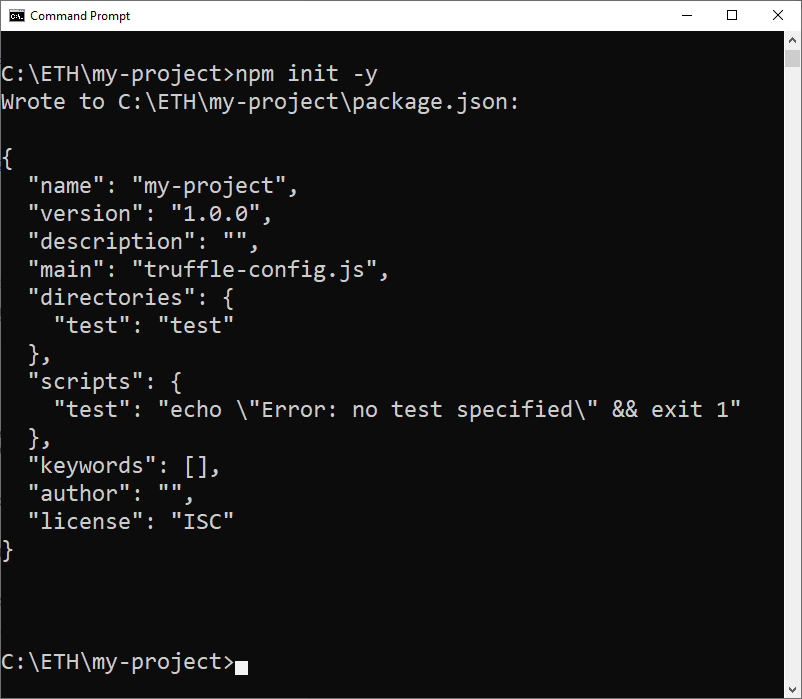
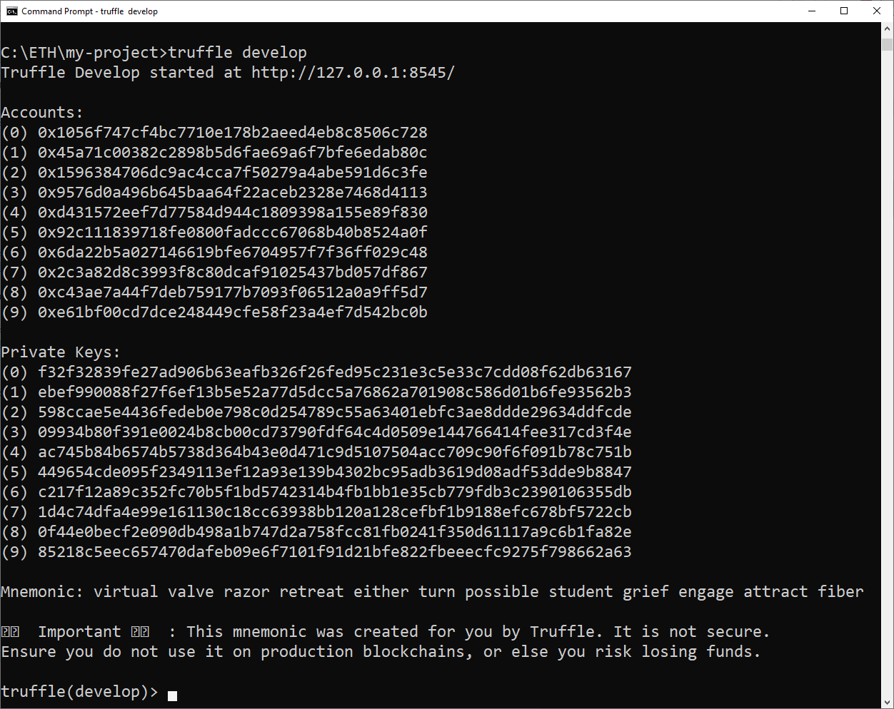

# Truffle project prerequisites

Before you create a Truffle project, you need to have Truffle and other useful tools installed in your computer.
In this tutorial, I will show you step-by-step on how to install and configure the prerequisites to use Truffle framework.

## Overview

Here is a summary of the requirements to install:

1. [Git](#git)
2. [POSIX compliant shell](#posix-compliant-shell)
3. [cURL](#curl)
4. [Node.js and NPM](#nodejs-and-npm)
5. [Code editor](#code-editor)
6. [Truffle framework](#truffle-framework)

## Git

[Git](https://git-scm.com/doc) is version control system, which is used for some other dependencies. Also it has some utilities, like `Git Bash`.

Maybe Git may already be installed. To find out, open a terminal and enter:

```shell
git --version
```


There are several ways to install Git. 
Check it out in the tutorial [Install Git](https://www.atlassian.com/git/tutorials/install-git)

**Windows OS**

There are other options for Windows:
- [Installer for Windows](https://git-scm.com/download/win).
- [Git for Windows](https://gitforwindows.org/).

## POSIX compliant shell

The **Portable Operating System Interface (POSIX)** is a family of standards specified by the IEEE Computer Society for maintaining compatibility between operating systems. POSIX defines the application programming interface (API), along with command line shells and utility interfaces, for software compatibility with variants of Unix and other operating systems.
Source: [Wikipedia](https://en.wikipedia.org/wiki/POSIX)

<!-- tabs:start -->

#### ** Linux **

Use the standard terminal

#### ** Mac OS **

Use the standard terminal

#### ** Windows OS **

If you use the standard `cmd` terminal, or `PowerShell`, the commands here may not work.

Consider using `Git Bash` which was installed in the previous step.

Here is a [Tutorial on installing and using Git Bash](https://www.atlassian.com/git/tutorials/git-bash)

<!-- tabs:end -->

## cURL

This is a system command that is likely already installed on your system,
which allows you to make network requests, such as HTTP requests,
from your command line.

If `curl --version` displays an error,
then [download curl](https://curl.haxx.se/download.html).

Result in Windows:


## Node.js and NPM

Another dependency is NPM, which comes bundled with Node.js.

To check if you have node already installed, enter this command into your terminal:

```shell
node --version
npm --version
```

This is the result in a Windows OS:


If there's no output like the one above, here's how to install it on Ubuntu, Mac OSX and Windows.

<!-- tabs:start -->

#### ** Linux **

```shell
sudo apt update
sudo apt install curl git
sudo apt install build-essential # We need this to build native dependencies
curl -sL https://deb.nodesource.com/setup_12.x | sudo -E bash -
sudo apt install nodejs
```

#### ** Mac OS **

```shell
curl -o- https://raw.githubusercontent.com/creationix/nvm/v0.35.2/install.sh | bash
nvm install 12
nvm use 12
nvm alias default 12
npm install npm --global # Upgrade npm to the latest version
```

Make sure you have `node-gyp` installed:

```shell
npm install -g node-gyp
```

This next setp is needed to build native dependencies.
A popup will appear and you have to proceed with an installation.
It will take some time, and may download a few GB of data.

```shell
xcode-select --install
```

#### ** Windows OS **

Installing Node.js on Windows requires a few manual steps.

Go to [Node.js](https://nodejs.org/en/) to download and install it.

Then [open your terminal as Administrator](https://www.howtogeek.com/194041/how-to-open-the-command-prompt-as-administrator-in-windows-8.1/) 

Also you need to install NPM's `Windows Build Tools`

```shell
npm install --global --production windows-build-tools
```

and run the following command: 

```shell
npm install -g node-gyp
```

<!-- tabs:end -->

### Comments about Node.js and NPM

NPM is usually installed together with Node.js, so after installing Node.js, there's no need to install it separately.

If you want to have more than one version installed,
the most fuss-free way to install and manage multiple versions of `node` on your computer is 
[nvm](https://github.com/nvm-sh/nvm). Note that `nvm` was used in Mac OSX.

> [!ATTENTION]
> If you're seeing errors mentioning "node-gyp", you need to install it.

## Code editor

We need some software that is able to edit text files.
Preferably one that has support for syntax highlighting for both Solidity and Javascript.

[VS Code](https://code.visualstudio.com/) is a good choice if you don't already have one.

### Visual Studio Code (VS Code)

Go to [VS Code download](https://code.visualstudio.com/download) if you would like to use it too.

Verify if your VS Code installation was successful by typing the following command into the terminal:

```shell
code -v
```



### VSCode extension for Solidity

If you decided to use VSCode, it is great to have Solidity support. 
I use the solidity extension from [Juan Blanco](https://marketplace.visualstudio.com/items?itemName=JuanBlanco.solidity).

To install it, go to extensions (Menu View -> Extensions):

1. Type `solidity` in the search field.
2. Select `solidity`  extension from Juan Blanco.
3. Click `install`.



## Truffle framework

[Truffle framework](https://www.trufflesuite.com/truffle) is a popular development framework with a mission to make smart contract development easier for developers. Amongst its features, it has a smart contract lifecycle management, scriptable deployment & migrations, automated contract testing and simple network management.

To install Truffle, we only need one command to install `Truffle`:

```shell
npm install -g truffle
```



To verify that `Truffle` is installed properly,
close the terminal, open it again and check the `Truffle` version:

```shell
truffle version
```


If you see an error, make sure that npm modules are added to your path.

## Final message

Congratulations!
:tada:

You are ready to start your Blockchain developer journey using Truffle framework :)

:sun_with_face:
