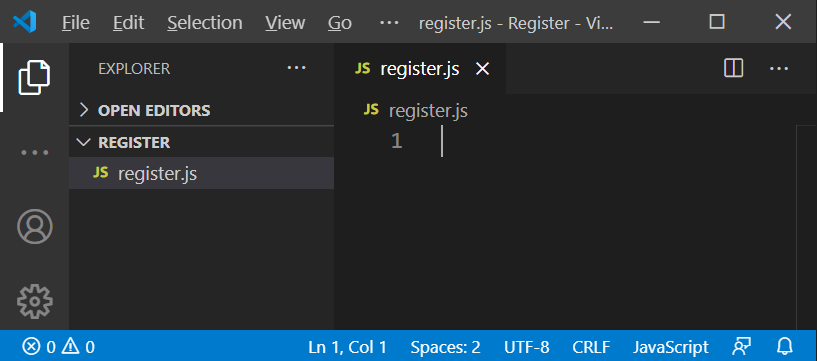
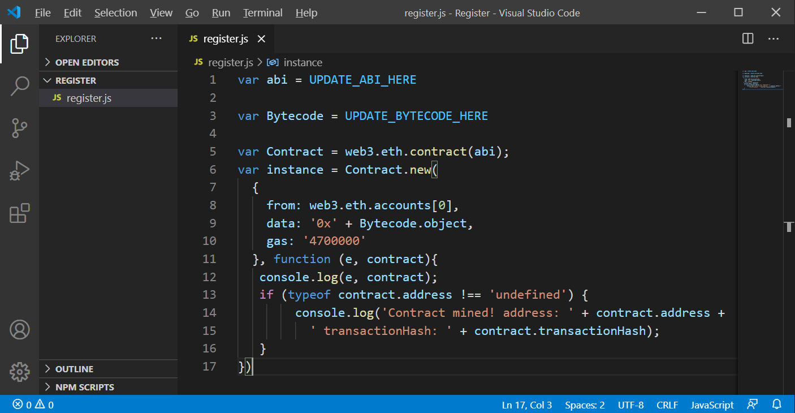
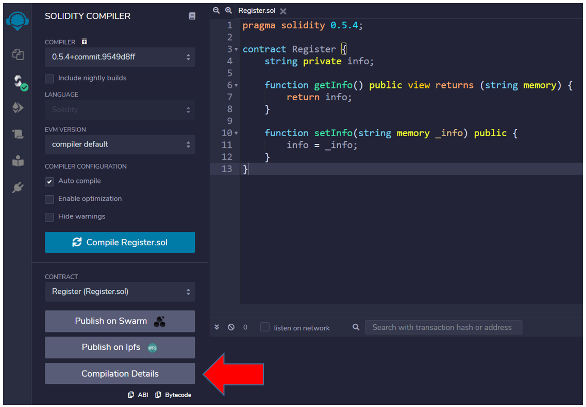
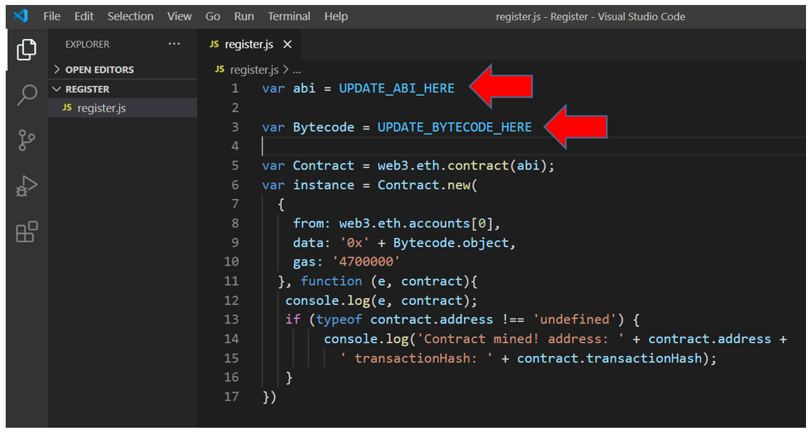

# Creando un archivo Javascript para implementar un contrato inteligente en la consola Geth

Siempre utilicé la herramienta `web3Deploy` de Remix para generar un script para publicar un contrato inteligente en la consola Geth.
Pero Remix ha actualizado la versión de web3js y ya no funciona automáticamente.
Remix ahora genera un script para publicar un contrato inteligente usando web3js> 1.0.

El antiguo web3js (<= 1.0) tiene un script diferente para implementar un contrato inteligente usando javascript.
Hasta hace algún tiempo, Remix usaba esta versión antigua, que funcionaba en la consola Geth.

La consola Geth todavía sigue usando una versión vieja de web3.js (<= 1.0), así que para hacer esto ahora, aún puede usar la información generada por Remix, pero necesita crear un script antiguo.

This [issue](https://github.com/ethereum/go-ethereum/issues/21016) is related to this subject.

> [!NOTE]
> I'm using Geth version 1.9.24 in this tutorial.

## Requisitos 

1. Cría un contrato inteligente

Estoy usando el contrato inteligente `Register`, de [creando un contrato inteligente](/es/remix/remix-create.md).

2. Compila el contrato inteligente `Register`

Si necesita ayuda, ve a [compilando un contrato inteligente](/es/remix/remix-compile.md).

## Creando el archivo Javascript 

En el editor de su elección, crea el archivo `register.js`.

También creé una carpeta llamada `Register` para poner este archivo.

Estoy usando el sistema operativo Windows y la ruta completa de mi archivo es:

```shell
C:\ETH\Register\register.js
```



Actualice su archivo con esta plantilla:

```javascript
var abi = UPDATE_ABI_HERE

var Bytecode = UPDATE_BYTECODE_HERE

var Contract = web3.eth.contract(abi);
var instance = Contract.new(
  {
    from: web3.eth.accounts[0], 
    data: '0x' + Bytecode.object, 
    gas: '4700000'
  }, function (e, contract){
   console.log(e, contract);
   if (typeof contract.address !== 'undefined') {
        console.log('Contract mined! address: ' + contract.address + 
          ' transactionHash: ' + contract.transactionHash);
   }
})
```



## Cambiando el nombre de las variables

1. El contrato inteligente se llama `Register`, así que sustituya `Contract` por `Register` en las líneas 5 y 6.
2. La instancia será `register`, así que reemplace "instancia" por `register` en la línea 6.


## Compilation Details

Vuelve a Remix.

La pantalla del compilador Solidity tiene un botón en la parte inferior izquierda llamado `Compilation Details` (detalles de la compilación):



> [!TIP]
> Si el botón `Compilation Details` no se muestra, debe compilar el contrato inteligente.

Se abrirá una ventana, que tiene información útil.
Desplazate abajo hasta encontrar `ABI` y `BYTECODE`.


Copia el `ABI` y cola en el archivo `register.js`, reemplazando la expresión `UPDATE_ABI_HERE`.



Haz lo mismo con el `BYTECODE`, 
copia el `BYTECODE` from `Compilation Details` y cola en el archivo `register.js`, reemplazando la expresión `UPDATE_BYTECODE_HERE`.

Echa un vistazo a una parte del `ABI`:


Tanbién puedes ver el `BYTECODE`:


Guarda el archivo.

> [!ATTENTION]
> Este script funciona en Geth 
> solo usando la versión Solidity <= 0.5.4

## Deploy en Geth

¡El archivo Javascript está listo para usarse en Geth para implementar el contrato inteligente Register!
:tada:

Ve a [implemente un contrato inteligente en el nodo local usando Geth y Remix](/es/geth/geth-deployweb3-remix-js.md) para aprender a hacerlo.

:sun_with_face: