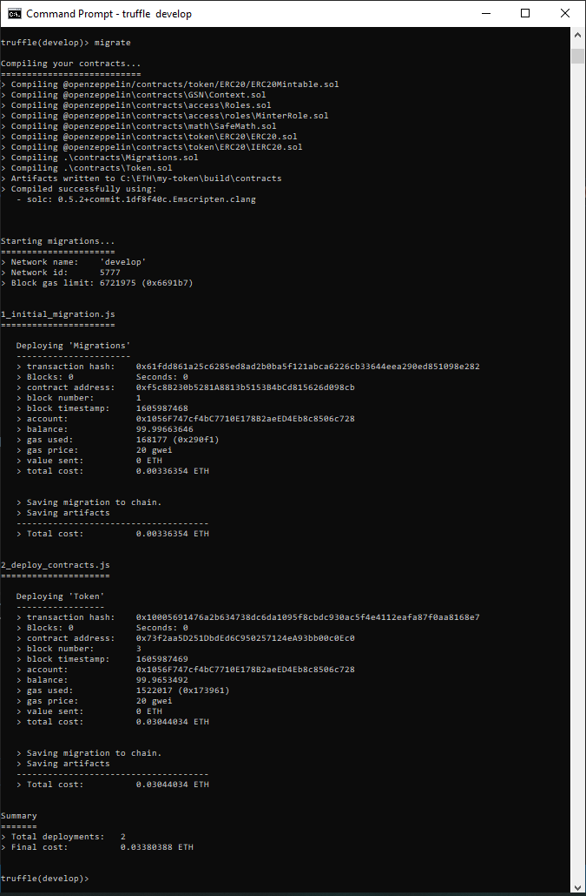
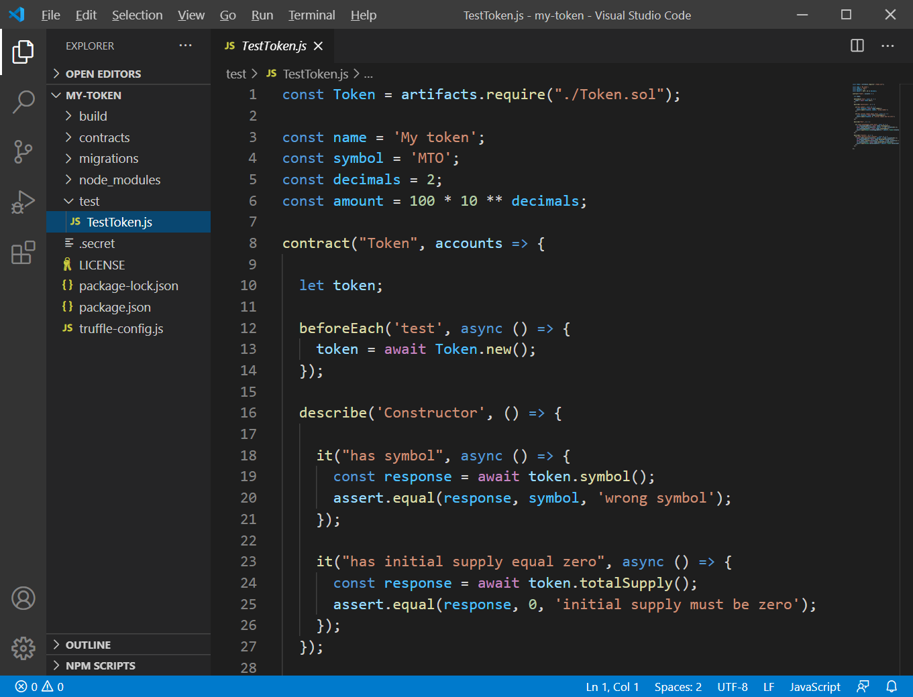
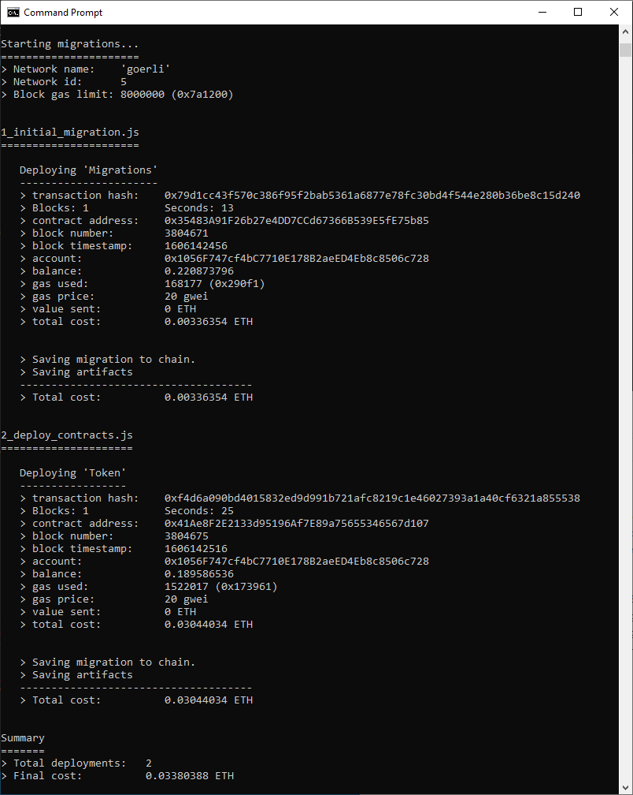

# Usando Truffle Sol token box

Los tokens se utilizan con mayor frecuencia para intercambiar o almacenar valor.
En este tutorial, te mostraré paso a paso cómo usar la Truffle box 
[sol-token-box-2020] (https://github.com/solangegueiros/sol-token-box-2020),
que viene con todo lo que necesita para crear un token estándar [ERC20](https://eips.ethereum.org/EIPS/eip-20).
Incluye configuración de red para implementar en la red [Görli testnet] (https://goerli.net/) y un token ERC20 mintable.

## Visión general

A continuación te listo un resumen de los pasos que vamos a seguir para crear nuestro token:

1. [Configurar los requisitos previos](#requisitos);
2. [Instalar Sol Token Box](#instalar-sol-token-box);
3. [Comprender el contrato inteligente](#tokensol)
4. [Aprender a usar la consola de desarrollo de Truffle](#truffle-development-console);
5. [Compilar token.sol](#compilar-el-contrato-inteligente);
6. [Hacer deploy del contrato inteligente](#deploy-el-contrato-inteligente);
7. [Ejecutar testes](#testar-el-contrato-inteligente);
8. [Interactuar con un contrato inteligente en la consola de desarrollo](#interactuar-con-un-contrato-inteligente-en-la-consola-de-desarrollo);
9. [Deploy en Blockchain](#hacer-deploy-en-el-blockchain);
10. [Verificar la conexión en la red](#verificar-la-conexión-en-la-red);
11. [Deploy en testnet Goerli](#deploy-en-gorli-testnet);
12. [Interactuar con el token en la red Goerli](#interactuar-con-el-token-en-la-red-goerli);
13. [Usar el token en Metamask](#usar-el-token-en-metamask);

Si fue redirigido desde la página
[Truffle sol-token-box 2020](https://github.com/solangegueiros/sol-token-box-2020) 
y ejecutó con éxito todas las instrucciones,
puede seguir adelante e interactuar con el contrato inteligente ya publicado:

- [In the Truffle development console](#interact-with-the-token-in-development-console)
- [On Goerli network](#interact-with-the-token-on-gorli-network)
- [Using the token in Metamask](#using-the-token-in-metamask)

Por otro lado,
si desea revisar los pasos con más detalles e imágenes explicativas,
este tutorial te resultará muy útil.

## Requisitos

[truffle-box-prerequisites-content](truffle-box-prerequisites-content.md ':include')

## Instalar Sol Token Box

El comando `truffle unbox` crea un proyecto basado en una plantilla conocida.
En este tutorial, usaremos el Truffle box **Sol token box**, 
que viene con todo lo necesario para crear un token ERC20 con menos de 10 líneas de código 
que usa los smart contract de Open Zeppelin como base y publicar en la red Görli testnet.

### Crea una nueva carpeta

Por ejemplo, crea la carpeta `my-token`.
Navega a la carpeta en la terminal.

```shell
mkdir my-token
cd my-token
```

### Ejecuta el comando unbox

El comando `truffle unbox` instalará todas las dependencias necesarias en el proyecto.

```shell
truffle unbox solangegueiros/sol-token-box
```

Este es el resultado con el SO Windows:


### Token.sol

Echa un vistazo al contrato inteligente `Token.sol`. 
Puedes consultarlo en la carpeta `contracts`.

```solidity
pragma solidity 0.5.2;
import '@openzeppelin/contracts/token/ERC20/ERC20Mintable.sol';
contract Token is ERC20Mintable{
       string public name = "My token";
       string public symbol = "MTO";
       uint8 public decimals = 2;
}
```

> [!TIP]
> Token.sol tiene solo 7 líneas de codigo!


Déjame explicarte el código anterior.

Este contrato inteligente es un token ERC20 mintable.
Esto significa que, además de la especificación estándar ERC20, tiene una función para emitir nuevos tokens.

Para crear nuestro Token ERC20, vamos a importar `ERC20Mintable` de Open Zeppelin. 
Esta biblioteca en sí misma importa varias otras bibliotecas como `SafeMath.sol`, 
los estándares para este tipo de token y la capacidad de acuñar tokens.

Dentro del token, definimos información básica sobre el token: `name` (nombre), `symbol` (símbolo) y número de `decimales` para la precisión.

Para heredar los atributos y funciones de la biblioteca, simplemente definimos nuestro contrato como un `ERC20Mintable` usando la palabra clave` is`.

## Truffle development console

[truffle-development-console-content](truffle-development-console-content.md ':include')

## Compilar el contrato inteligente

En la consola Truffle, ejecuta este comando:

```javascript
compile
```


## Deploy el contrato inteligente

[truffle-deploy-content](truffle-deploy-content.md ':include')

Echa un vistazo al archivo `2_deploy_contracts.js` ubicado en la carpeta `migrations`.

### Migrate

En la consola Truffle, ejecuta este comando:

```javascript
migrate
```

Y el `migrate output` debe ser similar a:



## Testar el contrato inteligente

[truffle-test-content](truffle-test-content.md ':include')

Este Truffle box también viene con el archivo `TestToken.js` para hacer pruebas en el contrato inteligente.
Puede comprobarlo en la carpeta `test`.

Echa un vistazo al extracto de este `TestToken.js`:



Ejecutando los testes:

```javascript
test
```


## Artifacts: Token.json

[truffle-artifacts-content](truffle-artifacts-content.md ':include')

El archivo `Token.json` se encuentra en la carpeta `build\contracts\`, por defecto.

Networks en Token.json


ABI en Token.json


## Interactuar con un contrato inteligente en la consola de desarrollo

Los siguientes comandos se ejecutarán dentro de la consola de desarrollo.
Ve a:

```shell
truffle develop
```

> [!ATTENTION]
> Asegúrese de implementar el contrato inteligente antes de ejecutar esta parte.

### Obtenga sus cuentas 

[truffle-console-accounts](truffle-console-accounts.md ':include')

### Conéctate con tu token publicado

En primer lugar, conéctese con su token:

```javascript
const token = await Token.deployed()
```

Ahora la variable `token` contiene una instancia del contrato implementado previamente.


> [!TIP]
> No se preocupe por la devolución `undefined`, es el defecto.

### Confirma si la instancia del token está bien

Ingresa el nombre de la instancia: `token`, luego` .` (punto), sin espacio, presione el botón <kbd>&#8677;</kbd> TAB dos veces para activar la función de autocompletar como se ve a continuación.
 
 Esto mostrará la dirección publicada del contrato inteligente y el hash de la transacción para su implementación, 
 entre otras cosas, incluidas todas las variables públicas y los métodos disponibles.

```javascript
token. [TAB] [TAB]
```


### Verifica el total supply

Para comprobar si ya tenemos tokens acuñados, llama a la función `totalSupply`:

```javascript
(await token.totalSupply()).toString()
```

El valor devuelto es 0, lo que se esperaba, ya que no realizamos ninguna acuñación inicial cuando implementamos el token.

### Consulta el saldo del token

Para ver el saldo de una cuenta, llame a la función `balanceOf`. 
Por ejemplo, para mirar el saldo de la cuenta 0:

```javascript
(await token.balanceOf(accounts[0])).toString()
```

El valor devuelto también es 0, lo que se esperaba, 
ya que no hicimos ninguna acuñación inicial cuando implementamos el token y, por definición, 
ninguna cuenta puede tener ningún token todavía.

Eche un vistazo a los resultados de total supply y balanceOf:


### Emite tokens

Ejecute este comando:

```javascript
token.mint(accounts[0], 10000)
```

Este comando envió una transacción para acuñar 100 tokens, con 2 decimales (00), para la cuenta 0.


También puede acuñar a una dirección específica, `0xa52515946DAABe072f446Cc014a4eaA93fb9Fd79`:

```javascript
token.mint("0xa52515946DAABe072f446Cc014a4eaA93fb9Fd79", 10000)
```


### Mira el saldo del token de nuevo

Vamos a verificar nuevamente el saldo de la cuenta 0:

```javascript
(await token.balanceOf(accounts[0])).toString()
```

El valor devuelto es 10000, que es 100 con 2 decimales de precisión. 
Esto es exactamente lo que esperábamos, ya que emitimos 100 tokens.

Además, puede obtener el saldo de una dirección específica, por ejemplo, `0xa52515946DAABe072f446Cc014a4eaA93fb9Fd79`:

```javascript
(await token.balanceOf("0xa52515946DAABe072f446Cc014a4eaA93fb9Fd79")).toString()
```

Mira los resultados:


### Verifica el total supply de nuevo

Verifique el suministro total nuevamente:

```javascript
(await token.totalSupply()).toString()
```


El valor devuelto es 20000, que es 200 con 2 decimales de precisión.
Después de acuñar 100 fichas para 2 cuentas, ¡es perfecto!

### Haz una transferencia de tokens

Vamos a transferir 40 tokens de la primera cuenta (`accounts[0]`) a la tercera cuenta (`accounts[2]`). 
Esto se puede hacer llamando a la función `transfer`.

```javascript
token.transfer(accounts[2], 4000, {from: accounts[0]})
```


**¿Qué pasa después de la transferencia?**

- accounts[2] no tenía tokens antes de la transferencia y ahora debería tener 40.
- accounts[0] debe tener 60 tokens.
- además, el suministro total será el mismo.

Revisemos el saldo de cada cuenta y el suministro total:

- Saldo de accounts[2]:

```javascript
(await token.balanceOf(accounts[2])).toString()
```

- Saldo de accounts[0]:

```javascript
(await token.balanceOf(accounts[0])).toString()
```

- Total supply, una vez más:

```javascript
(await token.totalSupply()).toString()
```

Mira los resultados:


¡Excelente!
Los saldos de ambas cuentas y el total supply son correctos.

### Salida del Truffle console

En el Truffle console, ingrese este comando para salir de la terminal:

```shell
.exit
```

## Hacer deploy en el Blockchain

Pasemos ahora a interactuar con un Blockchain "de verdad",
que se ejecuta en varios nodos distribuidos por todo el mundo,
en varias computadoras!

Necesitamos hacer algunas tareas:

- Configurar una cuenta / crear una billetera
- Actualizar .secret
- Obtener ETH
- Conectar a una red
- Pruebar la conexión en la red
- Implementar en la red de su elección

### Crear una billetera

[wallet-create-content](../wallets/wallet-create-content.md ':include')

### Görli testnet

[metamask-goerli](../wallets/metamask-goerli.md ':include')

### Actualizar .secret file

[secret-update](../wallets/secret-update.md ':include')

### Obtener ETHs en Görli testnet

Consulte cómo hacerlo en la página [Görli](/es/wallets/goerli.md).

[truffle-console-goerli](truffle-console-goerli.md ':include')

## Verificar la conexión en la red

[truffle-console-connection](truffle-console-connection.md ':include')

### Consulta el saldo

[truffle-console-balance](truffle-console-balance.md ':include')

Para salir de la consola Truffle:

```shell
.exit
```

## Deploy en Gorli testnet

[truffle-migrate-content](truffle-migrate-content.md ':include')

### Migrate en Görli network

Ejecuta lo siguiente comando directamente en la terminal (sin usar el Truffle console):

```shell
truffle migrate --network goerli
```

> [!TIP]
> El proceso de deploy lleva tiempo en un Blockchain "de verdad", 
> porque Truffle crea algunas transacciones que necesitan ser minadas e incluidas en los bloques.



¡Felicidades!
:tada:

El token ahora está publicado en la red.

> [!ATTENTION]
> Asegúrese de tener fondos suficientes para hacer el deploy. 

Copie y guarde la dirección del token. Lo usarás más tarde.

Por ejemplo, en la migración anterior, la dirección del token es [0x41Ae8F2E2133d95196Af7E89a75655346567d107](https://goerli.etherscan.io/address/0x41Ae8F2E2133d95196Af7E89a75655346567d107).

Puedes verificarla en [Etherscan - Goerli explorer](https://goerli.etherscan.io/address/0x41Ae8F2E2133d95196Af7E89a75655346567d107).


## Interactuar con el token en la red Goerli

Interactua con el contrato inteligente usando la consola de Truffle conectada a la red. 
Es lo mismo que hicimos para la consola de desarrollo Truffle, ¡pero ahora será para un blockchain real!

> [!ATTENTION]
> Asegúrese de haber hecho deploy del contrato inteligente antes de ejecutar esta parte.

Siga los mismos pasos que hicimos antes:

- Abre la consola Truffle conectada a la red en la que hizo deploy del token
- Obtenga sus cuentas 

- Get your accounts
- Conéctate con tu token
- Verificar el total supply
- Consultar el saldo del token
- Emitir tokens
- Hacer transferencia de tokens

## Usar el token en Metamask

Puede verificar el saldo o enviar tokens usando Metamask, 
la billetera web3 inyectada en el navegador previamente instalada.

Ve al tutorial [usando un token personalizado en Metamask](/es/wallets/metamask-custom-token.md).

## Consideraciones finales

En este tutorial aprendiste como usar el Truffle box [sol-token-box-2020](https://github.com/solangegueiros/sol-token-box-2020)
para crear su propio token ERC20 utilizando la biblioteca de contratos inteligentes Open Zeppelin en Truffle framework, conectado a la red Goerli testnet.

Espero que este tutorial haya sido útil y agradezco tus comentarios. 
Compártelo si te gusta :)

:sun_with_face:
