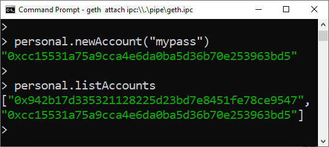

# Geth JavaScript Console

Geth tem um console JavaScript que pode ser utilizado com o nó Geth para enviar comandos e interagir com ele.

#### Geth console

O subcommando `console` executa o nó geth e abre o console, na mesma janela. 

#### Geth attach

O subcommando `attach` conecta o console a um nó geth que já está em execução em outra janela.

Saiba mais: [Geth javascriptconsole](https://geth.ethereum.org/docs/interface/javascript-console)

## Geth with IPC - Geth attach

Demonstrarei como usar Geth attach para se conectar a um nó local Geth já em execução e executar alguns comandos dentro dele.

> [!NOTE]
> Pode ser utilizado para qualquer nó Geth, mas aqui eu vou conectar a um nó local Geth.

## Run a Geth local node

Primeiro você precisa ter Geth executando em outra janela de terminal.

Va em [Geth local node](/pt/geth/geth-local-node.md) para mais informações.

## Geth attach usando IPC

Abra uma segunda janela de terminal.

Você pode se conectar em qualquer pasta, mas se tiver alguns arquivos javascripts para executar, é melhor fazer o attach na pasta do projeto.

Por exemplo, farei isso na pasta `C:\ETH\Register`.

O caminho IPC pode ser obtido quando o nó é executado, veja em [IPC Path](/pt/geth/geth-local-node?#ipc-path ':target=_blank')

```
geth attach ipc:\\.\pipe\geth.ipc
```


> [!WARNING]
> Este processo é apenas para um nó em execução em sua máquina ou em uma rede à qual você tenha acesso.
> Geth attach lhe dá controle total da instância remota, então não espere que outra pessoa lhe dê tal acesso a sua máquina.

## Dicas especiais

### Copiar e colar nos terminais SO Windows

No console Geth console, para colar alguma coisa que você copiou de outro lugar, utilize:

- Botão direito
- Seta para direita <kbd>&rarr;</kbd>

Não pressione as duas teclas ao mesmo tempo, mas sim em sequencia: primeiro `Botão direito`, depois `Seta para direita`.

### Listar comandos

Uma dica para listar os comando disponíveis. Tecle 2 espaços e a tecla TAB <kbd>&#8677;</kbd> duas vezes.
Este é o resultado:


## Personal e Accounts

Lista tudo que é relacionado às contas em seu nó local.

```js
personal
```


Mais informações sobre [accounts](https://geth.ethereum.org/docs/interface/managing-your-accounts)

### List Accounts

Este comando lista apenas as contas:


```js
personal.listAccounts
```


Este outro comando faz o mesmo:

```js
eth.accounts
```


### Criando uma conta

Crie nova conta:

```js
personal.newAccount("mypass")
```

> [!WARNING]
> É importante salvar ou guardar sua senha, ela é utilizada para criptografar sua chave privada no computador.
>
> No exemplo, a senha é `mypass`.


Este é o endereço, ou chave pública, da minha nova conta: 
`0x942b17d335321128225d23bd7e8451fe78ce9547`

Execute o comando `personal` de novo:

```js
personal
```


Veja que a conta aparece em `listAccounts`.

### Crie outra conta

Vamos criar outra conta, que será `account[1]`.

> [!NOTE]
> A primeira posição da lista de contas é o índice zero, então a segunda conta é `account[1]`.

```js
personal.newAccount("mypass")
```

A `account[1]` é
`0xcc15531a75a9cca4e6da0ba5d36b70e253963bd5`

Ejecute el comando `listAccounts` nuevamente:

```js
personal.listAccounts
```



## Mineração

Inicie a mineração

```js
miner.start(1)
```

Pare a mineração

```js
miner.stop()
```

Aprenda mais sobre [mining](https://geth.ethereum.org/docs/interface/mining) 

## Saldos

Para saber o saldo de uma conta, por exemplo, `account[0]`:

```js
eth.getBalance(eth.accounts[0])
```

Obtivemos um número grande porque o resultado está apresentado em wei. Podemos converter para Ether:

```js
web3.fromWei(eth.getBalance(eth.accounts[0]),"ether")
```


### Saldo de uma conta específica

Gostaria de saber o saldo de uma conta usando o endereço, como `0x942b17d335321128225d23bd7e8451fe78ce9547` que criei antes:

```js
web3.fromWei(eth.getBalance("0x942b17d335321128225d23bd7e8451fe78ce9547"),"ether")
```


## Desbloqueando uma conta

Antes de enviar uma transação a partir de uma conta, você deve desbloqueá-la para gastar os fundos armazenados nela.

```js
personal.unlockAccount(eth.accounts[0], "mypass", 0)
```

Os parâmetros são:
1. a conta que será desbloqueada: eth.accounts [0]
2. a senha para esta conta: `mypass`
3. duração para o desbloqueio expirar. A duração padrão é 300 segundos. Um 0 explícito no parâmetro duração desbloqueia a conta enquanto o console Geth estiver aberto.


## Transferindo Ethers

Gostaria de transferir 20 Ethers da `accounts[0]` para `accounts[1]`:

```js
eth.sendTransaction({from:eth.accounts[0], to:eth.accounts[1], value: web3.toWei(20, "ether")})
```

O retorno foi um hash de transação. Isso significa que minha transação foi enviada para o Blockchain e será incluída em um bloco em alguns segundos.

Agora verificarei o saldo da `accounts[1]`:

```js
web3.fromWei(eth.getBalance(eth.accounts[1]),"ether")
```

Este é o resultado:


:tada: 

`accounts[1]` tem 20 Ethers!

## Saindo do Geth

Para sair do console geth:

```js
exit
```


## Considerações finais

Espero que tenha sido fácil usar o Geth, que é um cliente Ethereum, para interagir com um nó local.

:sun_with_face:
