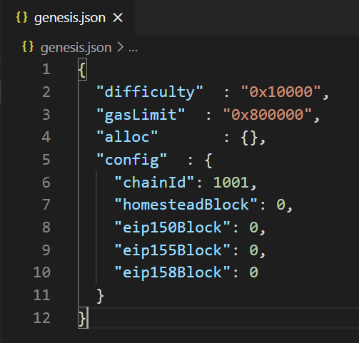
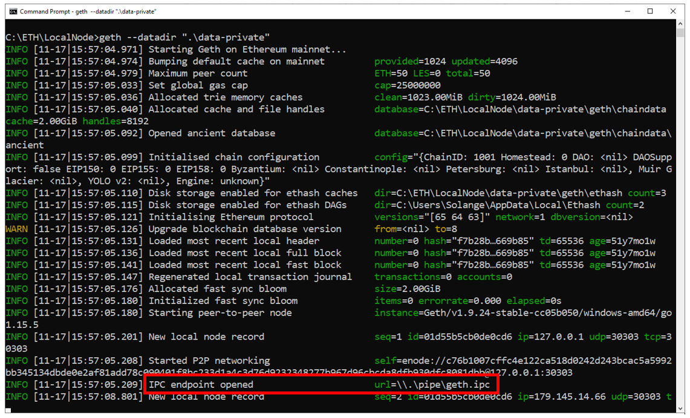

# Geth - criando um nó local

Neste tutorial mostrarei passo a passo como criar um nó local Ethereum usando o cliente Ethereum Geth.

## Download and instalação do Geth

Se ainda não o fez, vá para
[instalação do Geth](/pt/geth/geth-install.md)

## Arquivo Genesis

1. Crie ou escolha uma pasta para criar o arquivo genesis.

Farei na pasta `C:\ETH\LocalNode`.

No prompt de comando:

```shell
cd C:\ETH
mkdir LocalNode
cd LocalNode
```


2. No editor de sua preferência, crie um arquivo chamado `genesis.json`.

Copie e cole esta configuração:

```shell
{
	"difficulty"	: "0x10000",
	"gasLimit"  : "0x800000",
	"alloc"     	: {},
	"config"	: {
    "chainId": 1001,
    "homesteadBlock": 0,
    "eip150Block": 0,
    "eip155Block": 0,
    "eip158Block": 0
	}
}
```



## Geth init

Vá para o terminal,
na pasta onde você criou o arquivo `genesis.json`

Execute este comando para inicializar um novo Blockchain:

<!-- tabs:start -->

#### ** Linux **

Se você estiver na pasta de instalação do Geth:

```shell
./geth --datadir "/home/eth/data-private"  init "genesis.json"  
```

#### ** Mac OS **

Na pasta de instalação do Geth:

```shell
./geth --datadir "/home/eth/data-private"  init "genesis.json"  
```

#### ** Windows OS **

```shell
geth --datadir "data-private" init "genesis.json"  
```

<!-- tabs:end -->

A base de dados do Blockchain estará na pasta `data-private`.


## Executando Geth

```shell
geth --datadir ".\data-private"
```


## IPC path

O IPC path será utilizado depois para fazer a conexão ao seu nó, então anote.


Meu IPC path é 

```shell
\\.\pipe\geth.ipc
```

## Attaching a JavaScript Console to you node

Vá em [Geth JavaScript Console](/pt/geth/geth-console-attach.md) para aprender como utilizar o console Javascript para enviar alguns comandos para o nó.

:sun_with_face:
