# Blockopoly

Este é uma divertida variação de um famoso jogo de tabuleiro em que propriedades como bairros, casas, hotéis ou empresas são compradas e vendidas, em que uns jogadores ficam "ricos" e outros vão à falência. No Brasil é conhecido como 'Banco imobiliário', ou 'Monopoly' no mundo. A ideia principal do jogo mapeia muito bem os sistemas Blockchain e vamos construir partes do jogo para demonstrar isto.

O jogo `Blockopoly` foi inspirado em uma excelente iniciativa da [Microsoft Reactor](https://developer.microsoft.com/en-us/reactor/). Nossas propriedades são os espaços `Reactors` espalhados pelo mundo:


Nestes espaços é possível experimentar tecnologias líderes da indústria na Microsoft, parceiros e comunidades de código aberto, enquanto os profissionais da área se encontram, aprendem e criam conexões.

O tutorial está dividido em 3 partes.

## Overview do tutorial

Aqui está um resumo das etapas que faremos neste tutorial (nas 3 partes):

1. Pré requisitos;
2. Arquitetura do jogo;
3. Para cada smart contract, vamos:
    1. Criar o arquivo Solidity;
    2. Compilar;
    3. Publicar;
    4. Interagir com ele.
4. Vamos jogar!
    1. Publicação do jogo;
    2. Entrada dos jogadores;
    3. Início do jogo;
    4. Saldos dos jogadores;
    5. Propriedades disponíveis;
    6.  Comprando uma propriedade;
    7.  Término do jogo;
    8.  Ganhador.
5. Próximos passos - upgrades;
6. Publicando em Blockchain;
7. Considerações finais.

## Pré-requisitos

### Remix

Remix é uma ferramenta Ethereum online. É um IDE (Integrated Development Environment - ambiente de desenvolvimento integrado) usado para escrever, compilar, publicar e depurar código fonte em Solidity. Pode ser conectado ao Metamask e, com essa conexão, utilizado para publicar contratos inteligentes em diversas redes.

Vá em [remix.ethereum.org](http://remix.ethereum.org/)

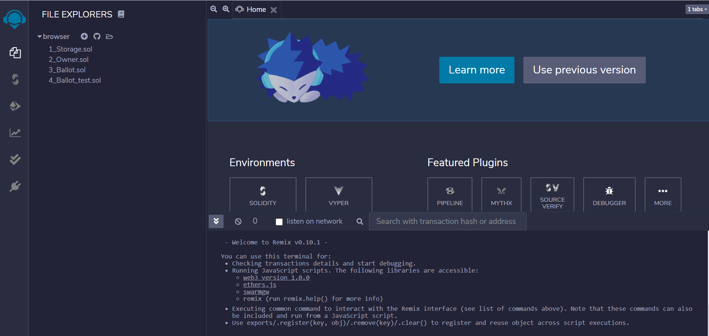

Na página inicial - home / welcome page, escolha o ambiente / environment `Solidity`.

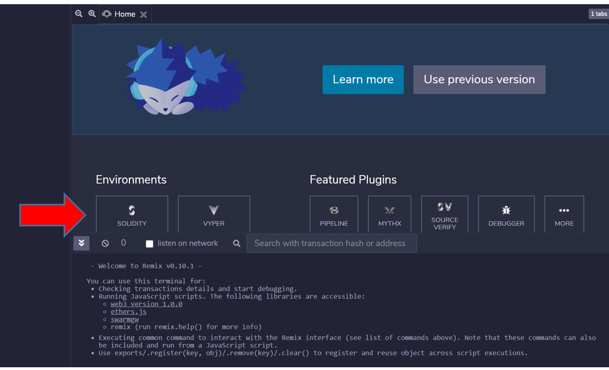

#### Terminal

No Remix, na parte de baixo, à direita, existe um terminal com algumas bibliotecas disponíveis.

Você pode enviar comandos e transações por aqui. Também apresenta o resultado das transações e / ou chamadas às funções de smart contracts.

> Esta área de retorno é muito importante para acompanhar os resultados!

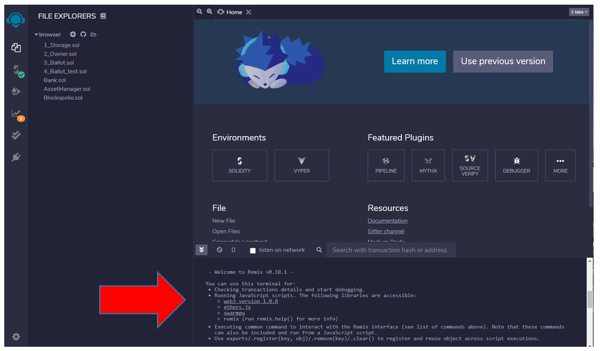

### Solidity compiler

Clique no 3o botão do lado esquerdo - Solidity compiler

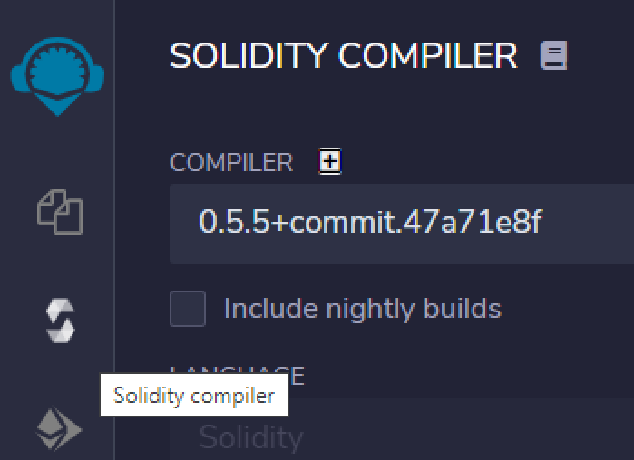

Habilite o auto-compile para facilitar sua vida.


Verifique a versão do compilador.

Nosso projeto precisa pelo menos da versão 0.5.5, ou qualquer outra acima.

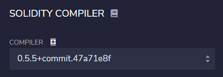

### Deploy and run transactions

No painel à esquerda, clique no botão `Deploy and run transactions`. Atualmente é o 4o botão.

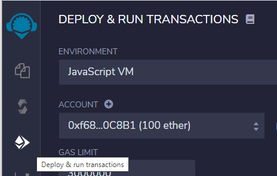

O Remix possui o ambiente `JavaScriptVM`, um simulador de Blockchain que acontece na memória do browser.


### Accounts

Este simulador possui diversos endereços / contas com Ethers fictícios que podemos escolher para publicar um smart contract ou interagir com ele.

Veja um exemplo de lista de contas:


A cada vez que você inicia o Remix ou faz uma atualização na página, a lista de contas é alterada.

## O jogo

Nosso jogo é composto por 3 smart contracts: 

* Bank
* AssetManager
* Blockopoly

### Bank

O banco é a entidade que controla o dinheiro, tanto a emissão dele quanto as transferências e os saldos de cada um. 

### Asset Manager

É um gerenciador de ativos, no nosso caso é o administrador das propriedades que serão negociadas. 

### Blockopoly

Este é o smart contract principal do jogo. Através dele são definidos jogadores, propriedades negociadas, início, final do jogo e o ganhador.

Então vamos lá! 

Chegou o momento de criar e interagir com cada um deles.

## Bank

Neste smart contract estarão as regras da entidade que controla o dinheiro, tanto a emissão dele quanto as transferências, além dos saldos de cada um. 

## Crie o smart contract

Clique no 2o botão do lado esquerdo - `file explorers`

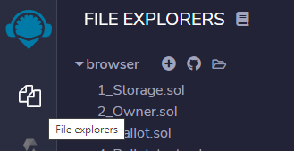

Clique no símbolo `+` create a new file.

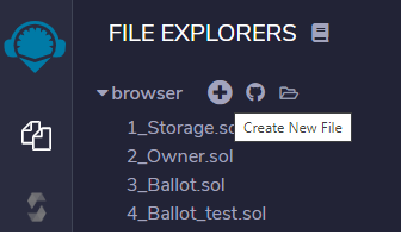

Nome do arquivo / file name: `Bank.sol`

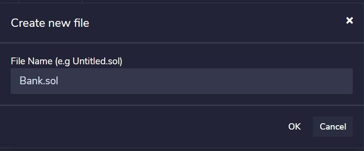

Copie o códido fonte:

```javascript
pragma solidity >=0.5.0 <0.7.0;

contract Bank {
    // The keyword "public" makes variables
    // accessible from other contracts
    address public minter;
    mapping (address => uint) private balances;

    // Events allow clients to react to specific
    // contract changes you declare
    event Sent(address from, address to, uint amount);

    // Constructor code is only run when the contract
    // is created
    constructor() public {
        minter = msg.sender;
    }

    // Sends an amount of newly created coins to an address
    // Can only be called by the contract creator
    function mint(address receiver, uint amount) public {
        require(msg.sender == minter, "Sender == Minter");
        require((amount < 1e60), "Amount isn't too big");

        balances[receiver] += amount;
    }

    // Sends an amount of existing coins
    // from any caller to an address
    function sendMoney(address receiver, address sender, uint amount) public {
        require(msg.sender == minter, "Only the banker can authorize transfers");
        require(amount <= balances[sender], "Insufficient balance.");
        balances[sender] -= amount;
        balances[receiver] += amount;
        emit Sent(sender, receiver, amount);
    }

    function getBalance(address account) public view returns (uint) {
        require(msg.sender == account || msg.sender == minter,
           "You cannot get a balance on someone else's account");
        return balances[account];
    }
}
```

E cole aqui:

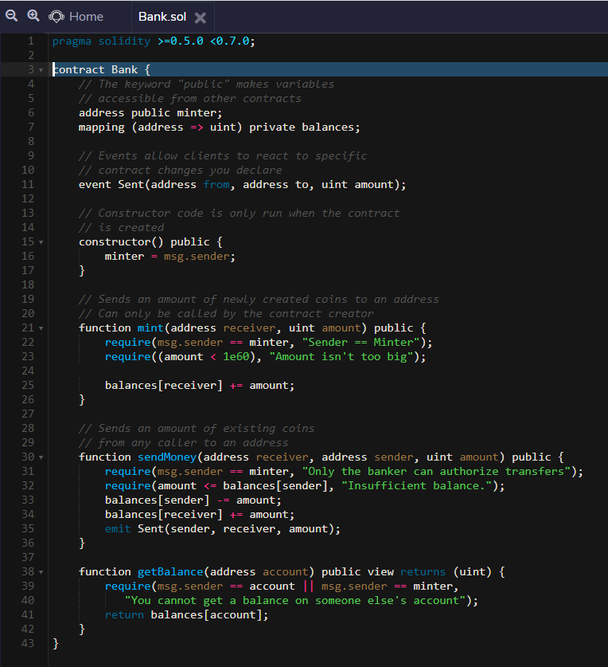

## Bank.sol

Este smart contract contém:

### Variáveis

* Uma variável pública `minter` para saber quem é o banqueiro, o emissor de dinheiro.
* Um mapping (variável do tipo chave -> valor) chamada `balances`, privada, que armazena o saldo de cada endereço.

### Eventos

* Um evento `Sent` que avisa cada vez que alguém envia dinheiro para outra pessoa.

### Construtor

O `constructor` (construtor), executado apenas no momento da criação do banco, define quem é o `minter`.

### Funções

* Uma função `mint` que faz a emissão de dinheiro.
* Uma função `sendMoney` para enviar dinheiro de um endereço para outro.
* Uma função `getBalance` que retorna o saldo de um determinado endereço.

## Compile o smart contract

Como a opção auto-compile está habilitado, provavelmente você verá o sinal verde no 3o botão com a mensagem `compilation successful`.

Caso isto não aconteça, compile manualmente: 

* Clique no 3o botão do lado esquerdo - Solidity compiler
* Clique no botão `Compile Bank.sol`

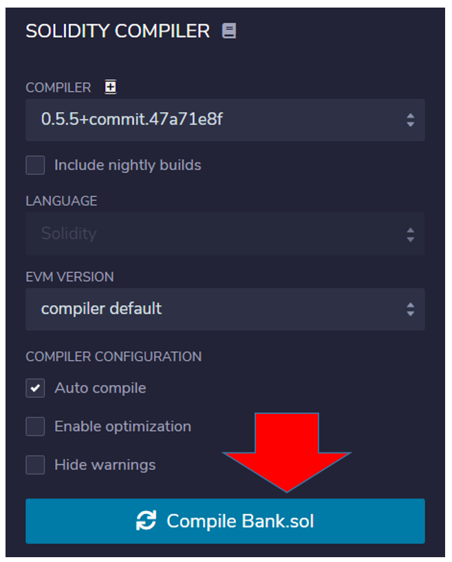

Verifique o sinal verde no 3o botão com a mensagem `compilation successful`


## Publique o smart contract localmente

No painel à esquerda, clique no botão `Deploy and run transactions`. Atualmente é o 4o botão.

Vamos publicar nosso projeto utilizando a primeira conta, que é o padrão.

Como nós só temos um smart contract, ele é automaticamente selecionado na lista.

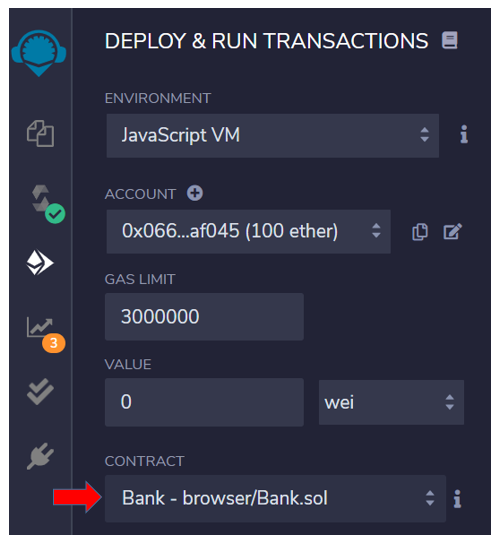

Clique no botão `Deploy`.

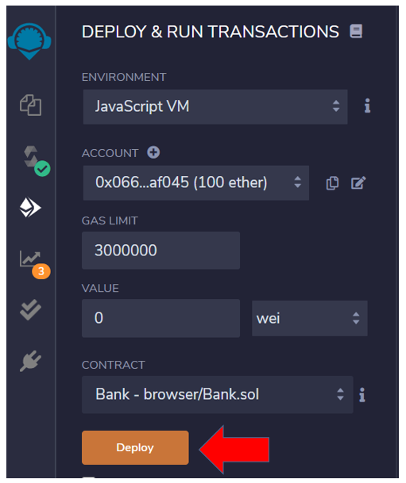

Confira no terminal, abaixo e à direita, a mensagem: `creation of  Bank pending …` e, em seguida, a transação de criação do smart contract.


É possível ver os detalhes da transação, clicando na seta à direita do botão Debug: 


## Interagindo com o smart contract

Quando fazemos a publicação de um smart contract utilizando Remix, podemos encontrá-lo no painel a esquerda, no item deploy and run transactions, `Deployed Contracts`:

Veja na parte debaixo da tela se o smart contract foi publicado:

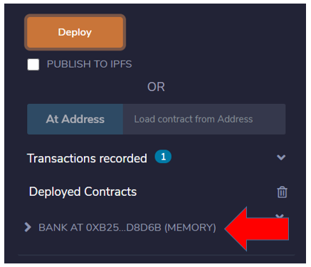

Clique em `>` para ver os detalhes do Bank:

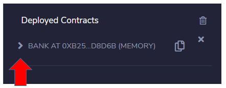

Aparecerão as mesmas funções que criamos em nosso smart contract!

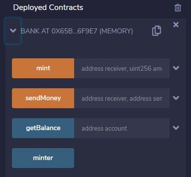

> Os botões laranja são as funções que fazem alterações no blockchain, são chamadas alterações de estado. Este tipo de função gasta gás quando utilizada.

> Os botões azuis são as funções somente leitura (read-only) e não fazem nenhuma alteração no blockchain. Não gastamos gás quando fazemos uma chamada para este tipo de função.

### Emissor

Clique no botão `minter` e veja quem é o emissor. É a conta que fez a publicação do smart contract. Em nosso caso, é a primeira conta da lista `ACCOUNT`, final  `0C8B1`.


Veja a chamada da função no terminal: 


Você pode acompanhar detalhes como custo de gás e conta para todas as chamadas de funções pelo terminal.

### Saldos

Para consultar o saldo de uma conta, preencha a mesma no parâmetro ao lado do botão getBalance e clique no botão `getBalance`.

Por exemplo, vou consultar o saldo da primeira conta, `0xf68Bb18400a3955353961e9C4bfD11A08540C8B1` 


O saldo é zero! Então vamos ao próximo passo para emitir moedas.

### Emissão de moedas

Apenas a conta do emissor pode emitir moedas. 

Com a conta 1 selecionada, emitirei 1000 moedas para ela mesma.

Recomendo clicar na seta para baixo ao lado direito do botão para expandir os parâmetros:


Vamos preencher a conta que receberá as moedas, e a quantidade:


E clicar no botão `transact`

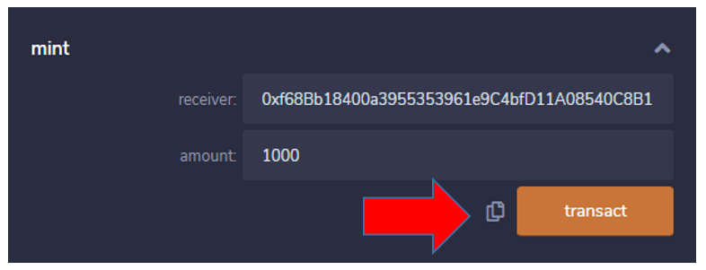

Você pode acompanhar os detalhes de cada transação no terminal: 


### Verifique o saldo novamente

Após a emissão de moedas, vou consultar novamente o saldo da primeira conta, `0xf68Bb18400a3955353961e9C4bfD11A08540C8B1` 


Maravilha! Agora temos 1000 moedas.

> Somente o dono do banco ou a própria conta consegue consultar seu saldo!

### Envie dinheiro

A conta 1 vai enviar 300 moedas para a conta 2 da lista: 

`0x68C200267086Bb2bc1e2Ed17912EA1b17e7f0D3e`

Apenas o banqueiro tem autorização para enviar dinheiro de uma conta para outra, então é importante selecionar na lista a conta 1, final `0C8B1`.

Recomendo clicar na seta para baixo ao lado direito do botão `sendMoney` para expandir os parâmetros e preenchê-los, depois clique no botão `transact`:


### Evento *Sent*

Expanda os detalhes da transação `sendMoney` e procure a parte logs. Você encontrará o evento `Sent`, com os detalhes da transferência de moedas:

* From - quem enviou
* To - destinatário
* Amount - quantidade


### Saldos após a transferência

Consulte o saldo da conta 2, veja que agora tem 300 moedas.


E o valor foi subtraído no saldo da conta 1, que agora tem 700 moedas.


## Próximos passos

Nesta parte do tutorial do jogo `Blockopoly` foi ensinado como criar o smart contract `Bank`, utilizando a linguagem Solidity. Ele controla o dinheiro, os saldos de cada um, a emissão e transferências.  

Lembre-se que nosso jogo é composto de 3 smart contracts: 

* Bank
* AssetManager
* Blockopoly

Na próxima parte do tutorial continuaremos com o gerenciador de ativos, o smart contract `AssetManager`, que é o administrador das propriedades que serão negociadas. 

Continue em [Blockopoly - parte 2](/pt/projects/blockopoly-02/).

Espero que esse tutorial tenha sido útil e agradeço caso tenha algum feedback. Compartilhe o artigo caso tenha gostado :)

> Aguarde um vídeo sobre o assunto em meu canal: <a href="https://www.youtube.com/user/solangegueiros" target="_blank"> youtube Solange Gueiros</a>. Se quiser ser avisado quando a publicação acontecer, é só assinar o canal.