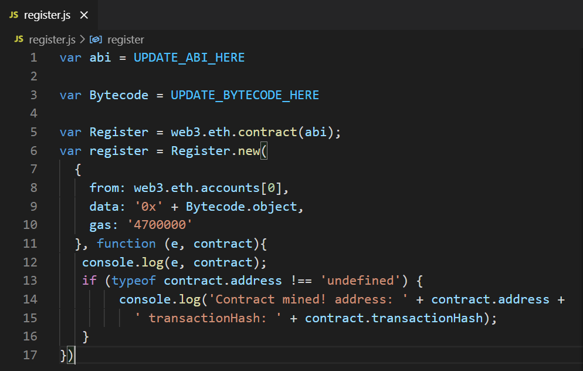
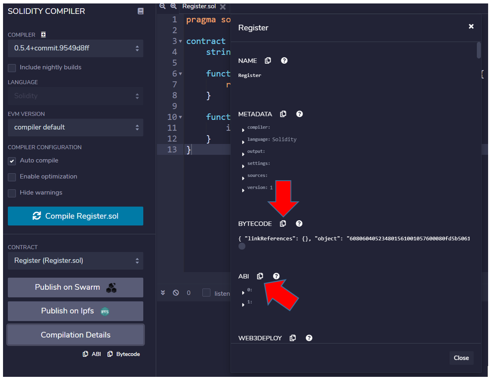
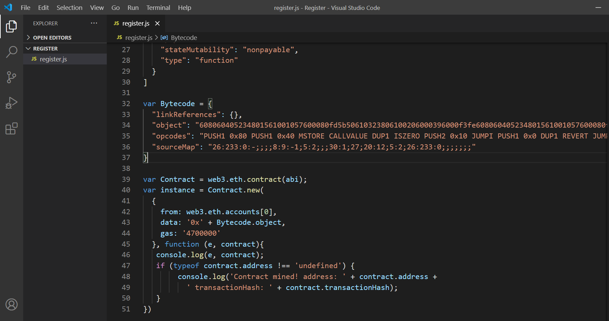

# Criando um arquivo Javascript para fazer deploy de um smart contract no console Geth

Eu sempre usei a ferramenta `web3Deploy` do Remix para gerar um script para publicar um smart contract no console Geth.
Mas o Remix atualizou a versão do web3js e não funciona mais automaticamente.
Agora Remix gera um script para publicar um smart contract utilizando web3js > 1.0.

O antigo web3js (<= 1.0) tem um script diferente para implantar um contrato inteligente usando javascript.
Até algum tempo atrás, o Remix usava esta versão antiga, que funcioava no console Geth.

Geth console continua usando o web3.js mais velho (<= 1.0), então, para fazer isto agora, ainda é possível usar as informações geradas pelo Remix, mas é preciso criar um script à moda antiga.

Este [issue no github](https://github.com/ethereum/go-ethereum/issues/21016) está relacionado con el ao assunto.

> [!NOTE]
> Estou usando Geth versão 1.9.24 neste tutorial.

## Pré requisitos 

1. Crie um smart contract

Estou utilizando o smart contract `Register`, desenvolvido em [criando um smart contract](/pt/remix/remix-create.md).

2. Compile o smart contract `Register`

Se precisar, vá em [compile um smart contract](/pt/remix/remix-compile.md).

## Criando o arquivo Javascript

No editor de sua escolha, crie o arquivo `register.js`.

Também criei uma pasta chamada `Register` para colocar este arquivo.

No SO Windows o caminho completo do meu arquivo é:

```shell
C:\ETH\Register\register.js
```


Atualize seu arquivo com este template:

```javascript
var abi = UPDATE_ABI_HERE

var Bytecode = UPDATE_BYTECODE_HERE

var Contract = web3.eth.contract(abi);
var instance = Contract.new(
  {
    from: web3.eth.accounts[0], 
    data: '0x' + Bytecode.object, 
    gas: '4700000'
  }, function (e, contract){
   console.log(e, contract);
   if (typeof contract.address !== 'undefined') {
        console.log('Contract mined! address: ' + contract.address + 
          ' transactionHash: ' + contract.transactionHash);
   }
})
```


## Renomeando variáveis

1. O smart contract é denominado `Register`, então substitua `Contract` por `Register` nas linhas 5 e 6.
2. A instância será `register`, então troque `instance` por `register` nas linha 6.



## Compilation Details

Volte ao Remix.

O painel do compilador Solidity tem um botão na parte inferior esquerda chamado `Compilation Details`:

Switch back to Remix.

Solidity compiler screen has a button at the left side botton called Compilation Details:


> [!TIP]
> Se o botão `Compilation Details` não estiver aparecendo, você precisa compilar o contrato inteligente.

Abrirá uma janela pop-up, que contém algumas informações úteis.
Navegue para baixo até encontrar `ABI` e `BYTECODE`.



Copie a  `ABI` e cole no arquivo `register.js`, substituindo a expressão `UPDATE_ABI_HERE`.


Faça o mesmo para o  `BYTECODE`, 
copie o `BYTECODE` de  `Compilation Details` e cole no arquivo `register.js`, substituindo a expressão `UPDATE_BYTECODE_HERE`.

Veja como ficou uma parte da `ABI`:


Veja também o `BYTECODE`:



Save the file.

> [!ATTENTION]
> Este script funciona no Geth 
> somente usando Solidity versão <= 0.5.4

## Deploy no Geth

O arquivo Javascript está pronto para usar no Geth para fazer o deploy do contrato inteligente Register!
:tada:

Vá a [publicação de smart contract em nó local usando Geth e Remix](/pt/geth/geth-deployweb3-remix-js.md) para aprender como fazer.

:sun_with_face: