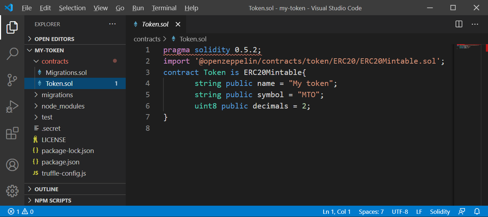
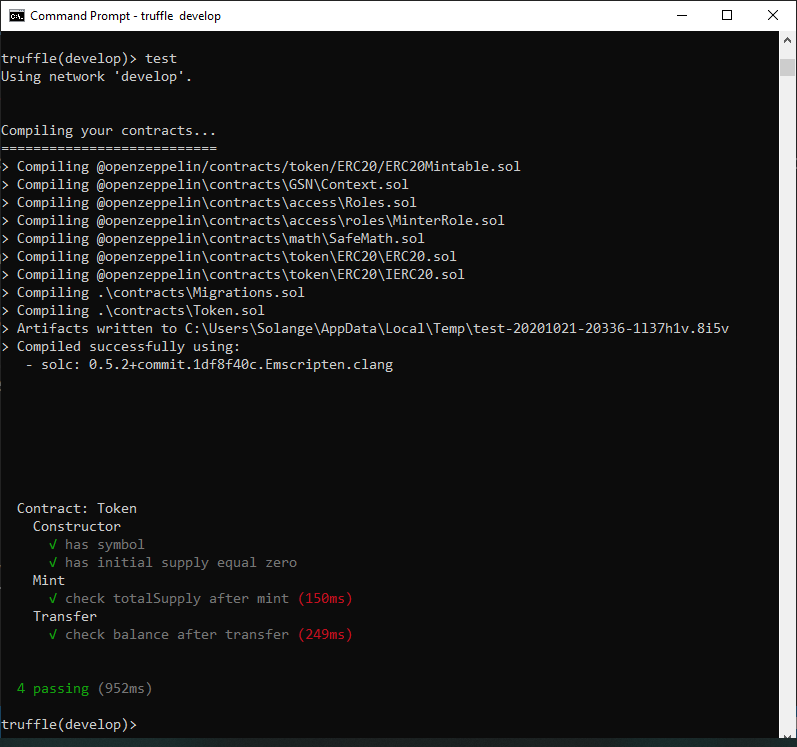
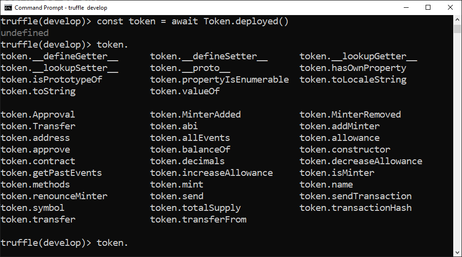
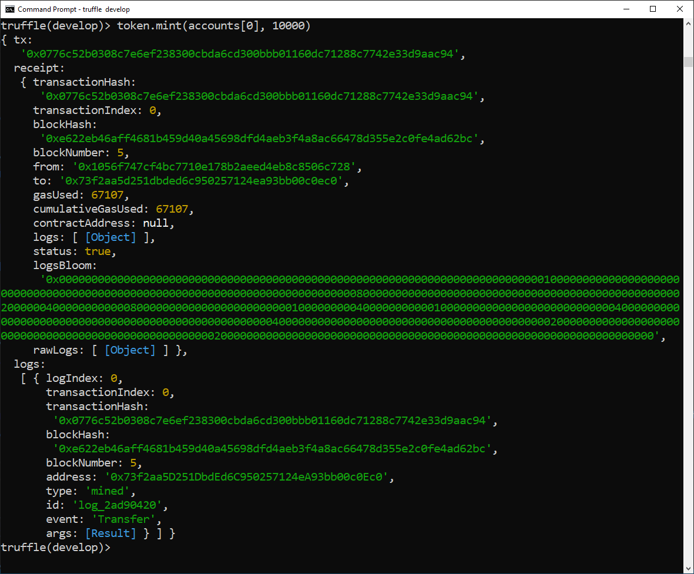

# Usando Truffle Sol token box

Tokens são muito utilizados para representar valores ou fazer trades.
Neste tutorial, mostrarei passo-a-passo como utiliza a Truffle box 
[sol-token-box-2020](https://github.com/solangegueiros/sol-token-box-2020), 
que vem com todo o necessário para criar um token padrão [ERC20](https://eips.ethereum.org/EIPS/eip-20). 
Inclui configuração de rede para fazer deploy na [Görli testnet](https://goerli.net/) e um token ERC20 com emissão sob demanda.

## Resumo

Aqui está um resumo das etapas que faremos para publicar nosso token:

1. [Configurar os pré requisitos](#pré-requisitos);
2. [Instalar Sol Token Box](#instalar-sol-token-box);
3. [Entender o smart contract](#tokensol)
4. [Aprender a usar o Truffle development console](#truffle-development-console);
5. [Compilar token.sol](#compile-o-smart-contract);
6. [Deploy do smart contract](#publique-o-smart-contract);
7. [Testes](#teste-o-smart-contract);
8. [Interagir com um smart contract no development console](#interagindo-com-o-token-no-develop-console);
9. [Deploy no Blockchain](#deploy-no-blockchain);
10. [Verificar a conexão com a rede](#testar-a-conexão-à-rede);
11. [Deploy na Goerli testnet](#deploy-na-gorli-testnet);
12. [Interagir com o token na Goerli network](#interagir-com-o-token-na-goerli-network);
13. [Utilizar o token no Metamask](#utilizando-o-token-no-metamask);

Se foi redirecionado a partir da página
[Truffle sol-token-box-2020](https://github.com/solangegueiros/sol-token-box-2020) 
e executou todas as instruções com sucesso, 
você pode interagir com o token:

- [No Truffle development console](#interact-with-the-token-in-development-console)
- [Na Goerli network](#interact-with-the-token-on-gorli-network)
- [Usanso o token no Metamask](#using-the-token-in-metamask)

Por otro lado,
se desejar revisar todos os passos com mais detalhes e imagens, 
este tutorial completo será muito útil.

## Pré-requisitos

[truffle-box-prerequisites-content](truffle-box-prerequisites-content.md ':include')

## Instalar Sol Token Box

O comando `truffle unbox` cria um projeto baseado em um template existente. 
Neste tutorial, usaremos **Sol token box** Truffle box, 
que vem com todo o necessário para criar um token padrão ERC20 com menos de 10 linhas de código,
usando os smart contrats da Open Zeppelin, e publicar na rede Görli testnet.

### Cria uma nova pasta

Crie uma nova pasta chamada `my-token`.
Vá para ela no terminal.

```shell
mkdir my-token
cd my-token
```

### Execute o comando unbox

O comando `truffle unbox` instalará todas as dependencias necessárias no projeto.

```shell
truffle unbox solangegueiros/sol-token-box
```

Este é o resultado no SO Windows:


### Token.sol

Veja o smart contract `Token.sol`. 
Ele está na pasta `contracts`.

```solidity
pragma solidity 0.5.2;
import '@openzeppelin/contracts/token/ERC20/ERC20Mintable.sol';
contract Token is ERC20Mintable{
       string public name = "My token";
       string public symbol = "MTO";
       uint8 public decimals = 2;
}
```

> [!TIP]
> Token.sol tem apenas 7 linhas de código!



Este smart contract é um `mintable ERC20 token`. 
Isto significa que, além da especificação padrão [ERC20](https://eips.ethereum.org/EIPS/eip-20), ele tem uma função para emitir novos tokens.

Para criar nosso token ERC20, importamos `ERC20Mintable` de [Open Zeppelin contracts](https://openzeppelin.com/contracts/). 
Esta biblioteca importa outras, como `SafeMath.sol`, além dos standards para este tipo de token, e a capacidade de emitir novos tokens.

Também definimos algumas informações básicas do token: `name` (nome), `symbol` (símbolo), e `decimals` (número de casas decimais).

Para herdar os atributos e funções da biblioteca, apenas definimos nosso contrato como `ERC20Mintable` utilizando a instrução `is`.

## Truffle development console

[truffle-development-console-content](truffle-development-console-content.md ':include')

## Compile o smart contract

No console Truffle, execute este comando:

```javascript
compile
```


## Publique o smart contract

[truffle-deploy-content](truffle-deploy-content.md ':include')

Dê uma olhada no arquivo `2_deploy_contracts.js`. localizado na pasta `migrations`. 

### Migrate

No console Truffle, execute este comando:

```javascript
migrate
```

O retorno - `migrate output` deve ser parecido com:


## Teste o smart contract

[truffle-test-content](truffle-test-content.md ':include')

Este Truffle box vem com o arquivo `TestToken.js` para testar o smart contract. 

Você pode dar uma olhada  na pasta `test`.

Veja um trecho de `TestToken.js`:


Executando os testes:

```javascript
test
```




## Artifacts: Token.json

[truffle-artifacts-content](truffle-artifacts-content.md ':include')

Por padrão, o arquivo `Token.json` está localizado na pasta `build\contracts\`.

Networks em Token.json


ABI em Token.json


## Interagindo com o token no develop console

Os próximos comandos serão executados no develop console.
Vá para ele:

```shell
truffle develop
```

> [!ATTENTION]
> Make sure you deploy the smart contract before executing this part.

### Suas contas / endereços 

[truffle-console-accounts](truffle-console-accounts.md ':include')

### Faça a conexão com seu token

Em primeiro lugar, faça a conexão ao token:

```javascript
const token = await Token.deployed()
```

Agora a variável `token` contém a instância do token publicado anteriormente.


> [!TIP]
> Não se preocupe com o retorno `undefined`, é normal. 

### Verifique se a instância está OK

Escreva o nome da variável:  `token`, tecle `.` e depois aperte a tecla <kbd>&#8677;</kbd> TAB duas vezes para acionar o recurso autocompletar. 
Será apresentado o endereço e hash da transação na publicação, além de outras coisas, incluindo todas as váriaveis e métodos públicos disponíveis. 

```javascript
token. [TAB] [TAB]
```




### Consulte o total de tokens

Chame a função `totalSupply` para verificar a quantidade de tokens já emitidos:

```javascript
(await token.totalSupply()).toString()
```

O valor retornado é 0, o que é esperado, dado que nós não fizemos uma emissão inicial ao publicar o token.

### Consulte o saldo de tokens

Chame a função `balanceOf` para saber o saldo de uma conta, por exemplo, da conta 0:

```javascript
(await token.balanceOf(accounts[0])).toString()
```

O valor retornado é 0, o que também é esperado, como não foi realizada uma emissão inicial ao publicar o token, o saldo de todas as contas será 0.

Veja os resultados para total supply e balanceOf:


### Emitindo tokens

Execute este comando:

```javascript
token.mint(accounts[0], 10000)
```

Está sendo enviada uma transação para a emissão de 100,00 tokens para a conta 0. 



Também é possível emitir para um endereço específico, por exemplo: `0xa52515946DAABe072f446Cc014a4eaA93fb9Fd79`:

```javascript
token.mint("0xa52515946DAABe072f446Cc014a4eaA93fb9Fd79", 10000)
```


### Consultando o saldo de tokens (de novo)

Verifique o saldo da conta 0 novamente:

```javascript
(await token.balanceOf(accounts[0])).toString()
```

O valor retornado é 10000, o que significa 100 com 2 casas decimais de precisão.
Isto é exatamente o que esperávamos, dado que emitimos 100 tokens

Você também pode consultar o saldo de um endereço específico, por exemplo, `0xa52515946DAABe072f446Cc014a4eaA93fb9Fd79`:

```javascript
(await token.balanceOf("0xa52515946DAABe072f446Cc014a4eaA93fb9Fd79")).toString()
```

Veja os saldos:


### Consultando o total supply (de novo)

Verifique o total de tokens novamente:

```javascript
(await token.totalSupply()).toString()
```


O valor retornado é 30000, que são 300 tokens com 2 casas decimais de precisão.
Depois de emitir 100 tokens para cada uma das 3 contas, está correto!

### Transfira tokens

Eu gostaria de transferir 40,00 tokens da primeira conta (`accounts[0]`) para a terceira conta (`accounts[2]`). 
Farei isto chamando a função `transfer`.

```javascript
token.transfer(accounts[2], 4000, {from: accounts[0]})
```


**O que acontece depois da transferência?**

- accounts[2] não tinha tokens antes, e agora deveria ter 40. 
- accounts[0] terá 60 tokens agora. 
- o total supply (emissão total) deve permanecer a mesma.

Vamos consultar o saldo de cada conta e a emissão total

- Saldo de accounts[2]:

```javascript
(await token.balanceOf(accounts[2])).toString()
```

- Saldo de accounts[0]:

```javascript
(await token.balanceOf(accounts[0])).toString()
```

- Total supply mais uma vez:

```javascript
(await token.totalSupply()).toString()
```

Veja os resultados:


Maravilha!
Os saldos das duas contas e a emissão total estão corretos.

### Saída do Truffle console

No Truffle console, digite este comando para sair do terminal:

```shell
.exit
```

## Deploy no Blockchain

Agora vamos publicar o smart contract em um Blockchain "de verdade", 
executado em diversos nós, em computadores espalhados pelo mundo! 

We need to do some tasks:

- Configurar uma conta / criar uma carteira
- Atualizar .secret
- Obter ETHs
- Conectar a uma rede
- Testar a conexão à rede
- Fazer deploy na rede escolhida

### Crie uma carteira

[wallet-create-content](../wallets/wallet-create-content.md ':include')

### Görli testnet

[metamask-goerli](../wallets/metamask-goerli.md ':include')

### Atualize o arquivo .secret

[secret-update](../wallets/secret-update.md ':include')

### Obtenha ETHs na Görli testnet

Veja as orientações na página [Görli](/pt/wallets/goerli.md).

[truffle-console-goerli](truffle-console-goerli.md ':include')

## Testar a conexão à rede

[truffle-console-connection](truffle-console-connection.md ':include')

### Verifique o saldo

[truffle-console-balance](truffle-console-balance.md ':include')

Para sair do Truffle console:

```shell
.exit
```

## Deploy na Gorli testnet

[truffle-migrate-content](truffle-migrate-content.md ':include')

### Migrate na Görli network

Execute este comando no terminal (não no Truffle console):

```shell
truffle migrate --network goerli
```

> [!TIP]
> O comando `migrate` pode demorar em um Blockchain de verdade, 
> porque Truffle cria algumas transações que precisam ser mineradas e incluídas no Blockchain.


Parabéns!
:tada:

O token agora está publicado no Blockchain.

> [!ATTENTION]
> Certifique-se de ter fundos suficientes para fazer o deploy. 

Copie e salve o endereço do token. Ele será utilizado depois.

Por exemplo, na migração acima, o endereço do token é [0x41Ae8F2E2133d95196Af7E89a75655346567d107](https://goerli.etherscan.io/address/0x41Ae8F2E2133d95196Af7E89a75655346567d107).

Você pode visualizá-lo no [Etherscan - Goerli explorer](https://goerli.etherscan.io/address/0x41Ae8F2E2133d95196Af7E89a75655346567d107).


## Interagir com o token na Goerli network

Vamos interagir com nosso token através do Truffle console conectado a rede Goerli.
É o mesmo que já fizemos no Truffle development console, mas agora conectado a um Blockchain de verdade!

> [!ATTENTION]
> Certifique-se de ter feito o deploy do smart contract antes de executar esta parte.

Faça as mesmas ações que fizemos antes:

- Abra o Truffle console conectado a rede na qual fez o deploy do token
- Recupere suas contas
- Faça a conexão com seu token
- Consulte o total de tokens
- Consulte o saldo de tokens
- Emita tokens
- Transfira tokens

## Utilizando o token no Metamask

Você pode consultar seu saldo ou enviar tokens usando Metamask, 
a carteira web3 injetada no navegador que foi instalada anteriormente.

Vá para o tutorial 
[usando um token customizado no Metamask](/pt/wallets/metamask-custom-token.md).

## Considerações finais

Neste tutorial você aprendeu como utilizar a Truffle box [sol-token-box-2020](https://github.com/solangegueiros/sol-token-box-2020)
para criar seu próprio token ERC20 token usando a biblioteca de smart contracts da Open Zeppelin no Truffle framework, conectado a rede Goerli testnet.

Espero que esse tutorial tenha sido útil e agradeço caso tenha algum feedback para mim. 
Compartilhe o artigo caso tenha gostado :)

:sun_with_face:
