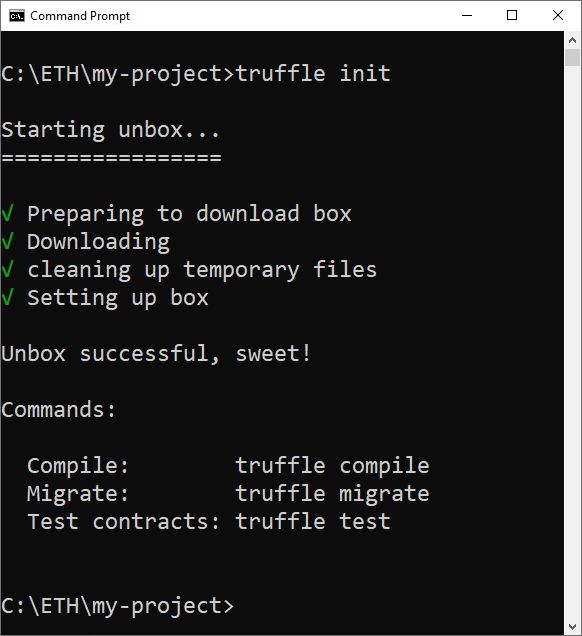

# Truffle project pre requisitos

Antes de criar um projeto Truffle, você precisa ter o Truffle framework e outras ferramentas úteis instaladas em seu computador.
Neste tutorial, mostrarei passo a passo como instalar e configurar os pré-requisitos para usar o Truffle framework.

## Overview

Aqui está um resumo dos requisitos para instalação:

1. [Git](#git)
2. [POSIX compliant shell](#posix-compliant-shell)
3. [cURL](#curl)
4. [Node.js and NPM](#nodejs-and-npm)
5. [Code editor](#code-editor)
6. [Truffle framework](#truffle-framework)

## Git

[Git](https://git-scm.com/doc) é um sistema open-source de controle de versão. Alguns pacotes que serão instalados posteriormente utilizam o Git internamente para fazer download de suas versões corretas.
Ele também tem alguns utilitários, como um terminal POSIX, chamado `Git Bash`.

Talvez você já tenha Git instalado.
Para descobrir, abra um terminar e digite:

```shell
git --version
```


Existem diversas maneiras de instalar Git. 
Veja este tutorial [Install Git](https://www.atlassian.com/git/tutorials/install-git) (em inglês).

**Windows OS**

Para Windos, existem outras opções também:
- [Installer for Windows](https://git-scm.com/download/win).
- [Git for Windows](https://gitforwindows.org/).

## POSIX compliant shell

**Portable Operating System Interface (POSIX)** é uma família de padrões especificados pela IEEE Computer Society para manter a compatibilidade entre sistemas operacionais. 
POSIX define a interface de programação para a aplicação (Application Programming Interface - API) para terminais de comandos e interfaces de utilitários, de modo que exista compatibilidade entre diversas variantes de Unix e outros sistemas operacionais.
Fonte: [Wikipidia](https://en.wikipedia.org/wiki/POSIX)

<!-- tabs:start -->

#### ** Linux **

Use o terminal standard

#### ** Mac OS **

Use o terminal standard

#### ** Windows OS **

Se você utilizar o terminal padrão `cmd` ou PowerShell, os comandos podem não funcionar. 

Utilize o terminal `Git Bash`, instalado juntamente com o `Git` no passo anterior.

Aqui está um [Tutorial on installing and using Git Bash](https://www.atlassian.com/git/tutorials/git-bash) (em inglês).

<!-- tabs:end -->

## cURL

Este é um sistema de comandos geralmente instalado no seu sistema operacional,
que permite que você faça requisições na rede, como solicitações HTTP,
diretamente do terminal.

Se o comando `curl --version` apresentar um erro, 
[download curl](https://curl.haxx.se/download.html).

Resultado no OS Windows:


## Node.js and NPM

Outra dependência é NPM, que é instalado com Node.js.

Pra verificar se Node.js e NPM já estão instalados, verifique se os comandos abaixo funcionam no terminal:

```shell
node --version
npm --version
```

Resultado no OS Windows:



Se não houve um retorno como acima, veja como instalá-lo no Ubuntu, Mac OSX e Windows.

<!-- tabs:start -->

#### ** Linux **

```shell
sudo apt update
sudo apt install curl git
sudo apt install build-essential # We need this to build native dependencies
curl -sL https://deb.nodesource.com/setup_12.x | sudo -E bash -
sudo apt install nodejs
```

#### ** Mac OS **

```shell
curl -o- https://raw.githubusercontent.com/creationix/nvm/v0.35.2/install.sh | bash
nvm install 12
nvm use 12
nvm alias default 12
npm install npm --global # Upgrade npm to the latest version
```

Tenha certeza de instalar `node-gyp`:

```shell
npm install -g node-gyp
```

O próximo comando é necessário para construir dependências nativas.
Uma janela pop-up aparecerá e você deverá prosseguir com a instalação.
Isso levará algum tempo e poderá fazer downlaod de alguns GB de dados.

```shell
xcode-select --install
```

#### ** Windows OS **

A instalação do Node.js no Windows requer alguns passos manuais.

Vá em [Node.js](https://nodejs.org/en/) para fazer download e instalar.

Depois [abra seu terminal como administrador](https://www.howtogeek.com/194041/how-to-open-the-command-prompt-as-administrator-in-windows-8.1/) 

E também instale NPM's `Windows Build Tools`

```shell
npm install --global --production windows-build-tools
```

Depois execute este comando: 

```shell
npm install -g node-gyp
```

<!-- tabs:end -->

### Sobre Node.js and NPM

O NPM geralmente é instalado junto com o Node.js, portanto, após instalar o Node.js, não é preciso instalá-lo separadamente.

Caso queira ter mais de uma versão do node instalada, 
utilize o gerenciador de versões para o node, chamado [nvm](https://github.com/nvm-sh/nvm).

> [!ATTENTION]
> Se você receber erros mencionando "node-gyp", certifique-se de tê-lo instalado.

## Editor para código-fonte

Precisamos de algum editor de código, de preferência um que destaque as linguagens Solidity e Javascript.

[VS Code](https://code.visualstudio.com/) é uma boa escolha, caso você não tenha nenhum.

### Visual Studio Code (VS Code)

Para instalar, [faça o download aqui](https://code.visualstudio.com/download).

Verifique se a instalação do VS code está ok consultando sua versão no terminal:

```shell
code -v
```


### VSCode extension for Solidity

Se você está utilizando o VSCode, é bom ter suporte à linguagem Solidity.
Eu uso a extensão solidity do [Juan Blanco](https://marketplace.visualstudio.com/items?itemName=JuanBlanco.solidity).

Para instalar, vá em Extensions (Menu View -> Extensions).

1. Digite `solidity` no campo de pesquisa.
2. Selecione a extensão `solidity` do Juan Blanco.
3. Clique em `install`.


## Truffle framework


[Truffle](https://www.trufflesuite.com/truffle) é um conhecido framework para desenvolvimento de smart contracts, que facilita a vida do desenvolvedor.
Entre suas características, podemos citar o gerenciamento da "vida" de um smart contract (você pode fazer várias publicações e saber qual foi a última), desenvolvimento de scripts para deploy, testes automatizados e gerenciamento de rede simplificado.

Para instalar Truffle, no terminal, digite o comando abaixo e pressione a tecla `enter`:

```shell
npm install -g truffle
```


Quando a instalação finalizar, feche a janela do terminal e abra novamente para verificar a versão do `Truffle`:

```shell
truffle version
```


Se retornar um erro, verifique se o NPM está adicionado ao Path.

## Menssagem final

Parabéns!
:tada:

Você está pronto para começar sua jornada como desenvolvedor Blockchain utilizando Truffle framework :)

:sun_with_face:
